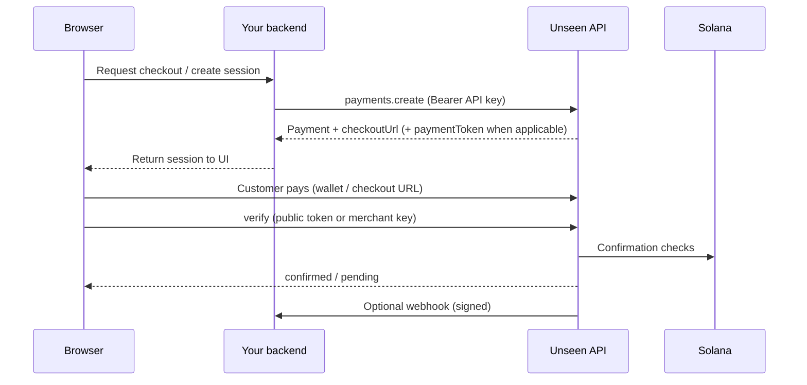

## What you get

Unseen Pay is an integration surface for privacy-preserving payments on Solana. Developers typically combine:

- **`@unseen_fi/sdk`** — Node/server SDK for creating payments, listing sessions, verifying on-chain status, and verifying webhook signatures.
- **`@unseen_fi/ui`** — React components for checkout UX (wallet picker, QR/deeplink flow, client verification polling).

See [Quickstart](/quickstart) for an end-to-end setup.

## Recommended architecture

For production, **prefer creating payment sessions on your server** so your live API key is not shipped to the browser. Pass the session into the UI via the `createPaymentSession` prop on [`UnseenPayButton`](/sdk/react/provider-button).

## Where content lives (Mintlify)

Documentation is **Markdown/MDX files** in this repository. The sidebar and site settings are defined in **`docs/docs.json`** at the workspace root of this Mintlify content. Mintlify deploys from the Git branch you connect in the dashboard; if this site lives inside a monorepo, set **Documentation path** to `/docs` per [Monorepo setup](https://www.mintlify.com/docs/deploy/monorepo).

## Next steps

<CardGroup cols={2}>
  <Card title="Quickstart" icon="rocket" href="/quickstart">
    Install packages and complete your first payment flow.
  </Card>
  <Card title="Environments" icon="settings" href="/concepts/environments">
    API hosts, `network`, and `baseUrl` for SDK and UI.
  </Card>
</CardGroup>
