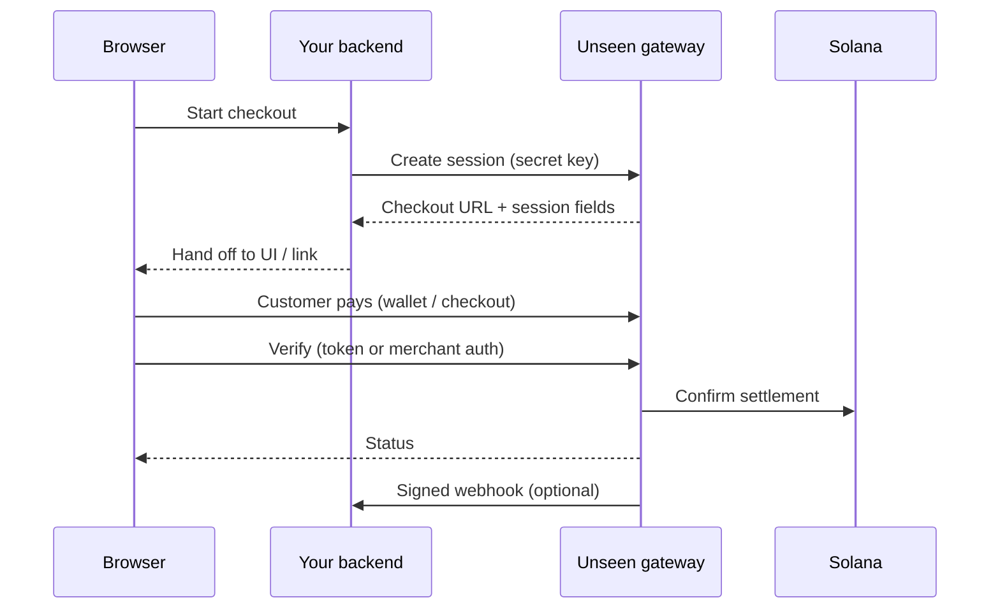

## Why Solana, and why payments need a gateway

Solana gives you fast settlement, cheap fees, and a single global ledger—ideal for moving value in real time. **[Solana Pay](https://solanapay.com)** and the wider ecosystem made it straightforward to request and settle payments on-chain: wallets, QR flows, and merchant standards are mature, and developers can build checkout experiences that feel familiar to web users.

Those patterns are powerful for **transparent** payments—where revealing the destination, amount, and flow on-chain is acceptable.

## The gap Unseen Pay fills

Many products need **stronger confidentiality**: shielding counterparty or amount details from public graph analysis, meeting compliance without advertising every transfer, or simply matching user expectations from traditional card privacy.

**Unseen Pay** is a **confidential payment gateway** on Solana. It sits between your application and the chain: you create **payment sessions**, your customers pay through wallets and hosted checkout flows, and Unseen helps you **verify settlement** and automate fulfillment—without turning your integration into raw, hand-rolled chain plumbing.

## What you gain

- **Privacy-oriented checkout** — Designed for flows where public, fully transparent payment rails are not enough.
- **Familiar merchant model** — Sessions, references, webhooks, verify calls—similar rhythm to other payment APIs.
- **Two official SDKs** — **`@unseen_fi/sdk`** for secure server work (create/list/verify, webhook HMAC), and **`@unseen_fi/ui`** for React checkout (modal, wallet picker, client verification).
- **Operational hooks** — **`payment.confirmed`**-style webhooks and **`payments.verify`** so you can fulfill orders idempotently next to your own database.

## Who this is for

Teams building **wallets, marketplaces, SaaS billing, or gated content** on Solana who want a **hosted gateway + SDKs** rather than re-implementing confidential settlement end to end.

---

## How this documentation is organized

Read in order—the sidebar matches this sequence so each page assumes the previous one.

| Step | Page | You will |
| ---- | ---- | -------- |
| 1 | **Introduction** (this page) | Understand motivation, benefits, and vocabulary. |
| 2 | [Quickstart](/quickstart) | Run the minimal server + React flow end to end. |
| 3 | [Architecture](/concepts/architecture) | See how browser, backend, Unseen API, and Solana connect. |
| 4 | [Environments](/concepts/environments) | Align `network`, `baseUrl`, and hosts for SDK vs UI. |
| 5 | [Payment lifecycle](/concepts/payment-lifecycle) | Learn statuses, verify outcomes, and fulfillment habits. |
| 6 | [Server SDK](/sdk/server/installation) | Install and call the API from Node. |
| 7 | [Webhooks](/webhooks/overview) | Operate signed webhooks in production. |
| 8 | [React SDK](/sdk/react/installation) | Embed checkout in your front end. |
| 9 | [Guides](/guides/nextjs-checkout) | Apply patterns (Next.js route, Express webhook). |
| 10 | [Troubleshooting](/troubleshooting) | Fix common errors quickly. |
| 11 | [Changelog](/changelog) | Track doc and package releases. |

Underlying pages (for example [Client & payments](/sdk/server/client-payments) or [Hooks & wallets](/sdk/react/hooks-wallets)) appear **inside** each sidebar group in the same order they should be read.

---

## At a glance — request flow

Once you have gone through [Architecture](/concepts/architecture), this diagram will match the words you use for each hop.

**Next:** [Quickstart](/quickstart)
